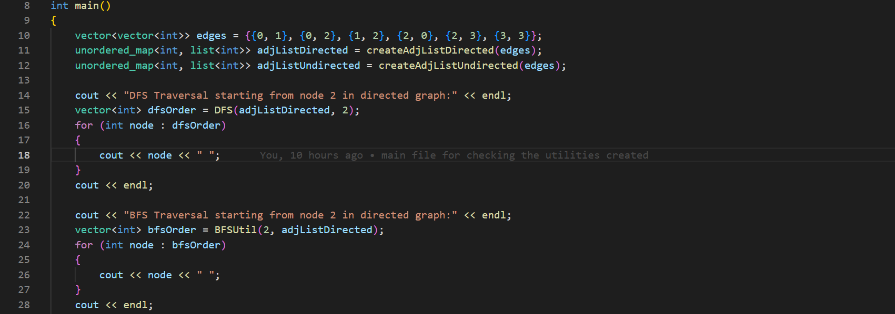
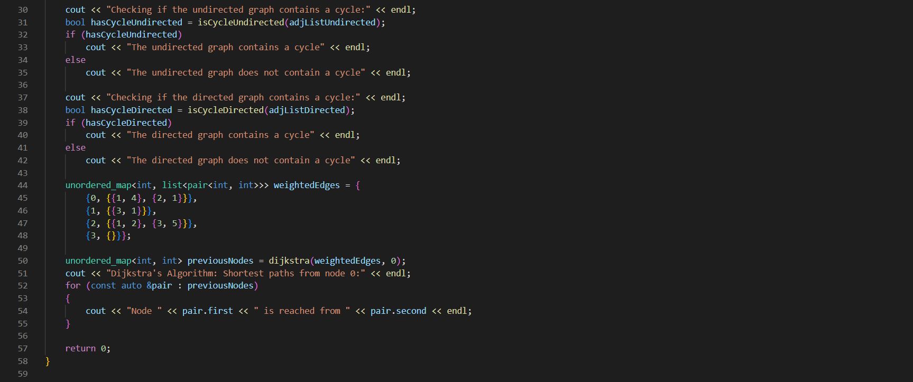

## Specific utilities for Graph (Personalized STLs)

This repository contains utilities for various graph functions which are used quite often while working with problems of graphs.

Some of them are as follows:

1. Creation of adjacency list from the edges of a directed or undirected graph
2. Checking whether a graph contains a cycle or not
3. Finding the shortest path starting from a particular node
4. Finding the breadth and depth first traversals of a graph

We just have to define the pre-processor directives in our working file and we'll be able to implement the above mentioned utilities by just invoking them.

Here's a demo of how to implement the above:






The above utilites can be quite essential where the user has to only focus on solving the problem and not on implementing the utilities from scratch everytime they encounter a DSA problem which require these utilities.

## Here's how you can utilize these:

1. Fork the repository
2. Clone the repository
   ```-sh
   git clone https://github.com/rks-031/graph-utils.git
   ```

## I'll be making updates to the repo by adding more useful utilities. Here's how you can Keep your fork in sync with the original repo:

1. Navigate to Your Forked Repo Directory:
   ```sh
   cd graph-utils
   ```
2. Add Upstream Remote:
   ```sh
   git remote add upstream https://github.com/rks-031/graph-utils.git
   ```
3. Fetch Updates from Upstream:
   ```sh
   git fetch upstream
   ```
4. Merge Updates into Your Local Branch:
   ```sh
   git checkout main
   ```
   ```sh
   git merge upstream/main
   ```

## Steps to Use on a Coding Platform:

1. _Copy the Entire Code_: <br/>Copy the consolidated code into the coding platform's editor.
2. _Modify the Main Function_: <br/>Adjust the main function according to the specific problem you are solving on the platform.
3. _Run and Submit_: <br/>Use the platform’s run and submit options to test and submit your solution.
